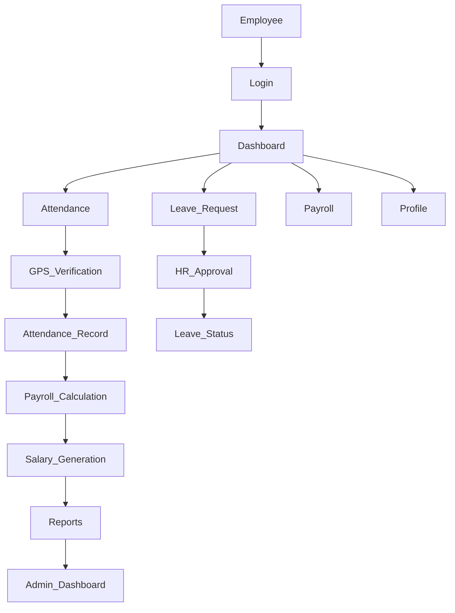

# Shivlal Manpower

### Smart HR & Workforce Management System

 

  
  
  
  

A complete HR & Workforce Management System designed to streamline employee management, attendance tracking, payroll processing, leave management, recruitment, and organizational operations.

**Portfolio:** https://innovativeais.com/others/portfolio-shivlal-manpower.php

---

## Table of Contents

- [About](#about)
- [Features](#features)
- [System Workflow](#system-workflow)
- [Core Modules](#core-modules)
- [User Roles](#user-roles)
- [Contact](#contact)
- [License](#license)

---

# About

Shivlal Manpower is a comprehensive Human Resource Management System (HRMS) developed to simplify workforce administration for organizations and manpower agencies.

The platform centralizes employee information, automates attendance with GPS verification, manages payroll, processes leave requests, supports recruitment activities, and provides real-time reports for better decision-making.

By digitizing HR operations, the system reduces manual work, improves operational efficiency, and enhances workforce productivity.

---

# Features

| Module | Description |
|---------|-------------|
| Employee Management | Employee profiles, departments, designations, and document management |
| GPS Attendance | Location-based check-in and check-out with attendance history |
| Selfie Attendance | Attendance verification using image capture |
| Payroll Management | Salary calculation, payslip generation, bonuses, and deductions |
| Leave Management | Leave applications, approvals, and leave balance tracking |
| Recruitment | Candidate management, interview scheduling, and onboarding |
| Shift Management | Employee shift scheduling and monitoring |
| Reports & Analytics | Attendance, payroll, leave, and employee performance reports |
| User Management | Role-based access control and account management |

---

# System Workflow

---

# Core Modules

- Employee Management
- Attendance Management
- GPS Attendance
- Selfie Verification
- Payroll Management
- Leave Management
- Recruitment Management
- Shift Management
- Reports & Analytics
- User Management
- Administrative Dashboard

---

# User Roles

## Administrator

- Manage employees
- Configure departments
- Manage attendance
- Process payroll
- Generate reports
- Manage users and permissions
- System administration

## HR Manager

- Employee management
- Leave approval
- Attendance monitoring
- Recruitment management
- Payroll processing

## Employee

- Mark attendance
- Apply for leave
- View attendance history
- Download payslips
- Update personal profile

---

# Contact

For project inquiries, software development, or business collaborations, feel free to contact us.

| Contact | Details |
|----------|---------|
| Website | https://innovativeais.com |
| Email | info@innovativeais.com |
| LinkedIn | https://www.linkedin.com/company/innovative-ai-solution-475489323 |

---

# License

This project is licensed under the **MIT License**. See the `LICENSE` file for complete license information.

---

## Shivlal Manpower

### Smart HR & Workforce Management System

Designed to simplify workforce operations through intelligent employee management, GPS-based attendance tracking, payroll automation, leave management, recruitment, and comprehensive HR administration.

Developed by **Innovative AI Solutions**

If you found this project useful, consider giving this repository a **Star**.

Thank you for visiting the repository.

